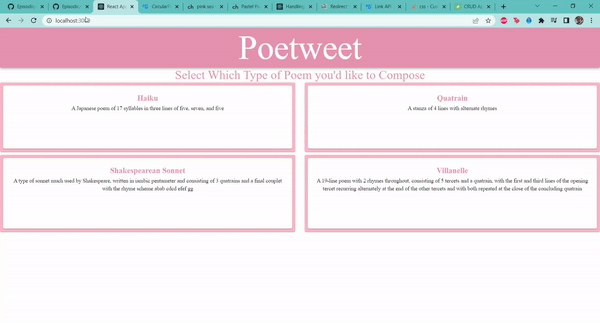

# Poetweet




## To Run:

### Recommended (But optional) step: Install Tweepy

- This is because the script that fetches tweets relies on tweepy
- If you *really* don't want to install this there are some tweets provided in /resources

```
$ sudo pip install tweepy
```

### To run the first 3 user stories by the first actor, type the command:

```
gradle runPoetweet
```

(If you didn't install tweepy you can't do user story 1 (menu option 1))

But you CAN make a haiku, free verse poem, or quatrain with the following twitter handles:

- dog_feelings
- ProBirdRights
- realDonalTrump

### And for the last user story by the second actor, type the command:

```
gradle runPoetweetAdmin
```


# User Stories

#### 1. As a poet, I want to be able to save the poems I've created in text files.

##### Acceptance Criteria:

- Given that I have no poems to save, when I select this option then nothing will happen.

- Given I have poems to save, when I select this option then the poems will be saved in the poems directory.

- Given that the poems directory contains a poem with the same name as a poem I'm trying to save, when I select this option the already-existing file will be overwritten.

  ##### Where to find this:

  - PoemSaver.java
  - SavePoemsMenuOption.java

#### 2. As a system administrator, I want to be able to clear the files of saved poems so that I can safely remove old data.

##### Acceptance Criteria:

- Given that I have a folder full of files, when I select this option then all the files will be deleted.

- Given that the folder is empty, when I select this option then nothing will change.

- Given that one of the files in the folder is open, when I select this options then all files but the open one will be deleted.

  ##### Where to find this:

  - ClearSavedPoemsAdminOption.java

#### 3. As a poet, I want to generate a free verse poem so that I can have a customized, personal poem based off a specific twitter user's tweets.

##### Acceptance Criteria:

- Given that I know a twitter handle, when I input said twitter handle then the tweets will be pulled and saved to a file.
- Given that I typed the wrong twitter handle, when I input said twitter handle then the system will fail gracefully (and yell at the user).

  ##### Where to find this:

  - FreeVerseGenerationOption.java
  - NonRhymingPoemGenerator.java

#### 4. As a poet, I want to generate a rhyming quatrain so that I can have a poem based off a specific twitter user's tweets.

##### Acceptance Criteria:

- Given that I have a file of tweets, when I ask nicely for the system to make me a poem then it will transform tweets into a rhyming quatrain.

- Given that a file of tweets does not exist, when I generate a poem it will pull the tweets and then make the poem.

- Given that the user provides an invalid twitter handle, when I try to generate a poem based on those non-existent tweets then the poem generation will terminate gracefully. 

- Given that the user does not have enough tweets, when I try to generate a poem from the user's tweets the system will throw an exception which is handled gracefully.

  ##### Where to find this:

  - QuatrainGenerationOption.java
  - RhymingPoemGenerator.java


# For Grading:

### Where to find Liskov Substitution Principle

- MenuOptionsFactory.java
- Menu.java  
  - The method runMenuOptions() in particular 
    - Basically the menu doesn't care about what classes any of the method options are, it just knows it can run the runMenuOption() method on the IMenuOption interface for each of the 8 different menu options and it will just work
- Any of the poem generation options

### Where to find Interface Segregation Principle

- The Menu/IMenuOption combo would be a nice place to look
- Any of the PoemGenerationOptions (Haiku, Free Verse, Quatrain)
- The PoemGenerator abstract class and its children, RhymingPoemGenerator and NonRhymingPoemGenerator
- Exceptions could also be a fun place to look

------

And from M1...

### Where to find Single Responsibility Principle

While I strived to follow this principle in all my classes, the place where this principle has the most impact is in my PoemGenerator class. This is because this class relies on multiple classes (TwitterScraper, TweetParser, and Poem) but changes to either of those three classes won't affect the generation of poems. The Poem can be different types (Haiku, Free Verse, Quatrain) but switching out those classes wouldn't affect the generation of the poem. Additionally, changing the functionality of TwitterScraper or TweetParser wouldn't affect PoemGenerator. 

### Where to find Open/Close Principle

- PoemGenerationOption.java

  - Implements IMenuOption.java
  - All the Poem Generation options extend it

  PoemGenerationOption is closed, because it's abstract, but it's open for extension by HaikuGenerationOption, FreeVerseGenerationOption, QuatrainGenerationOption, etc.
  
  - FreeVerseGenerationOption.java is a good example of extending the functionality of PoemGenerationOption

### Improvements

- I was told that I had a lot of classes, and it was suggested that I "Grouping together classes and enums or adding another function to an existing class (rather than making a new class for it) could help readability." 

  - In responding to this feedback I nested my 2 enums,  MenuOptionResult and PoemTypes, within the files of the classes that use them the most, Menu.java and Poem.java respectively.

- Additionally, I was told that I "Might want to think about combining a few of the very small classes for maintainability."

  - Bearing this in mind, I wrote my Exceptions Class

    

(ALSO FYI the syllable counter library that I used is buggy :( There's an issue on github about it, don't blame me.)

# Data Schema

All the tweets are stored in .csv files with 4 columns, outlined below.

| Column Name | Description                                    | Data Type |
| ----------- | ---------------------------------------------- | --------- |
| Username    | The username of the person who made the tweet. | VARCHAR   |
| Tweet ID    | The unique identification number of the tweet. | INTEGER   |
| Date/Time   | The date and time that the tweet was sent      | DATETIME  |
| Text        | The body of the tweet.                         | VARCHAR   |

